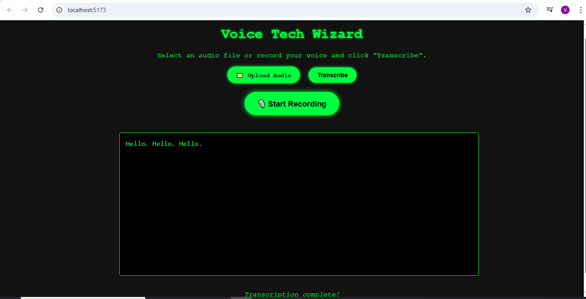
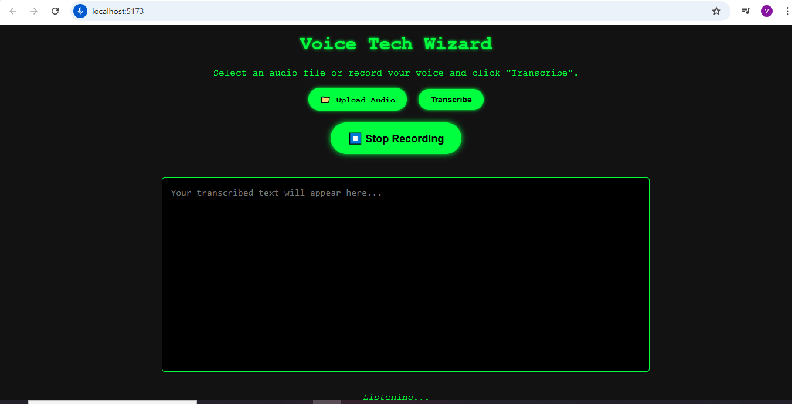

# 🎙️ Voice Tech Wizard

**Voice Tech Wizard** is a sleek web application that transcribes audio into text using the Deepgram Speech-to-Text API. It supports both:

- 📁 Uploading audio files for transcription
- 🎤 Real-time transcription via microphone recording

All with a retro neon-terminal UI!

---

## 🚀 Features

- ✅ Upload audio files (MP3/WAV/etc.) and transcribe them
- ✅ Start/stop microphone recording and get live transcriptions
- ✅ Dark-themed neon-styled UI with responsive design
- ✅ Built with **Vite**, using **JavaScript**, and styled with pure **CSS**
- ✅ Uses **Deepgram API** over secure WebSocket

---

## 🔧 Setup Instructions

### 1. Clone the Repo

```bash
git clone https://github.com/yourusername/voice-tech-wizard.git
cd voice-tech-wizard
```

### 2. Install Dependencies

```bash
npm install
```

### 3. Configure Deepgram API Key

Create a `.env` file at the root:

```bash
touch .env
```

Inside `.env`, add:

```
VITE_DEEPGRAM_API_KEY=your_deepgram_api_key_here
```

> 📌 You can get a free API key from https://console.deepgram.com

### 4. Run the App

```bash
npm run dev
```

Then open your browser at: `http://localhost:5173`

---

## 🖼️ Screenshots

### ✅ Initial Interface


---

### 📁 File Transcription Result



---

### 🎤 Live Recording in Action



---

## 🧠 Tech Stack

- **Frontend:** HTML, CSS, JavaScript (ES6+)
- **Build Tool:** Vite
- **Speech-to-Text API:** Deepgram

---

## 🤖 API Used

**Deepgram Real-time Streaming API**

- Audio sent via WebSocket
- Response contains transcribed text (live)

More info: [Deepgram Docs](https://developers.deepgram.com)

---

## ✨ Future Enhancements

- 🌐 Multilingual support
- 📤 Export transcripts
- 📱 PWA support

---

## 📄 License

MIT License. Feel free to use and contribute.
